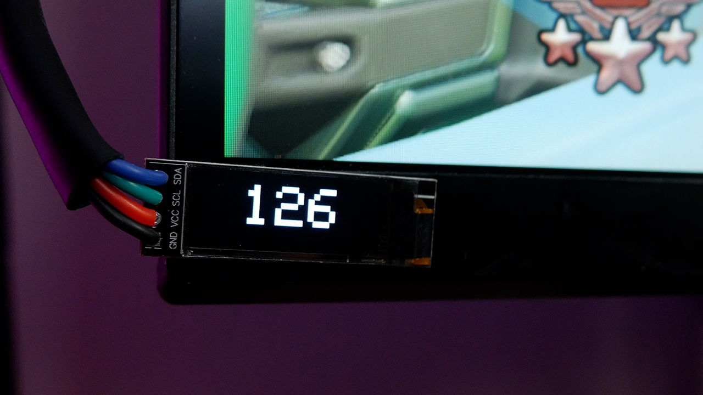

# Arduino FPS Display
Displays your in-game FPS on a Wifi connected OLED Module

[YouTube Video](9https://www.youtube.com/watch?v=R_vbQCu_4eU)

## How it works?
Using the RTSSharedMemory DLL from [RivaTunerStatics Server](https://www.guru3d.com/files-details/rtss-rivatuner-statistics-server-download.html) to get the in-game FPS. Then sends that information through a websocket to an ESP8266

## Credits
[Websocket library](https://github.com/zaphoyd/websocketpp)

[Batman Fix for OSD.cpp example](https://github.com/Kaldaien/BMF/blob/master/BMF/osd.cpp)
